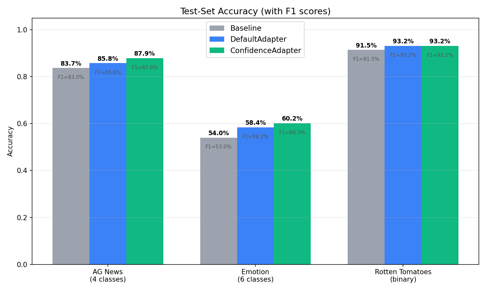
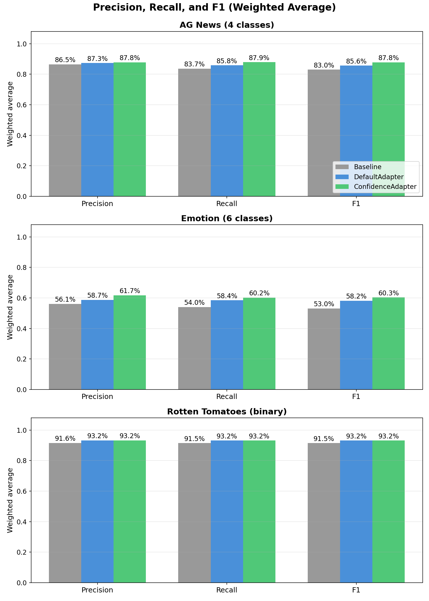
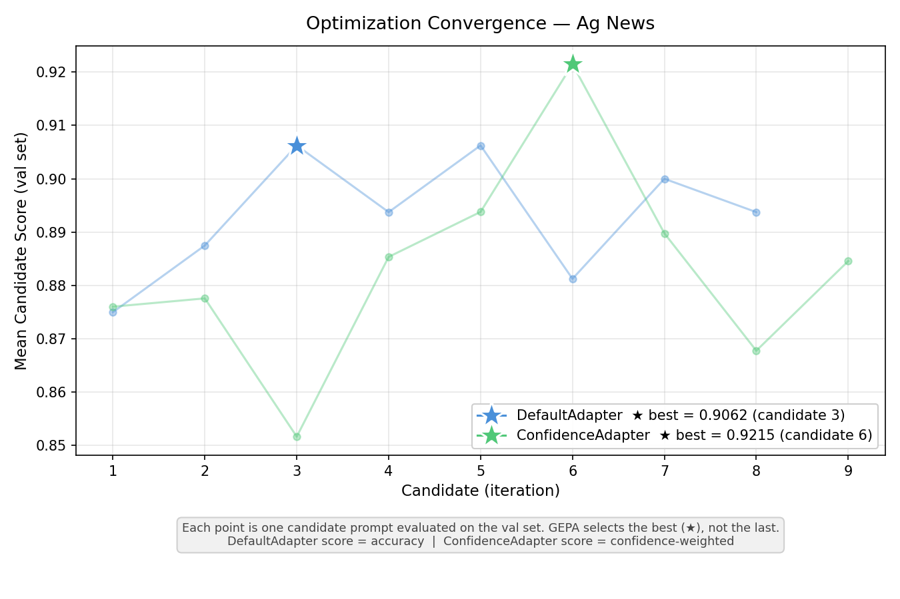
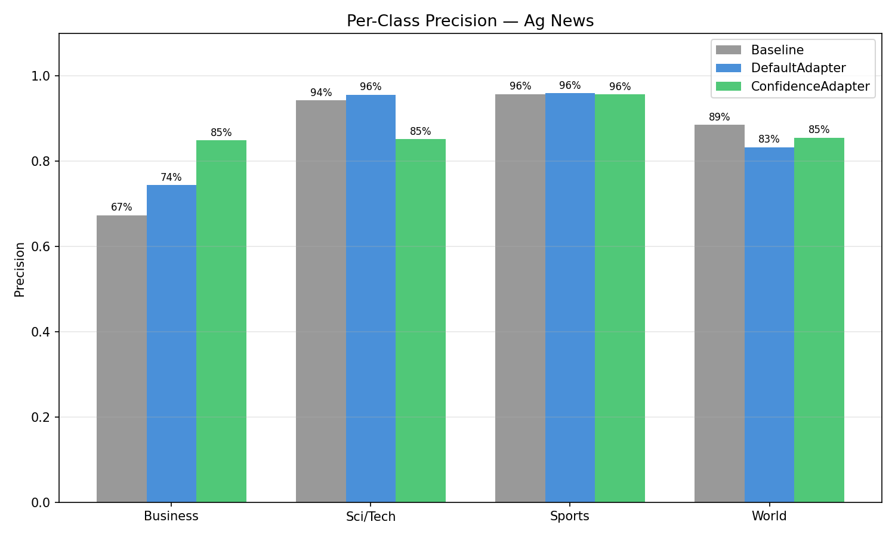
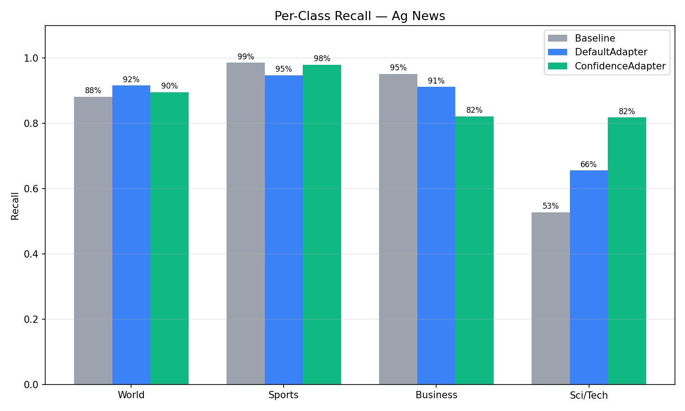
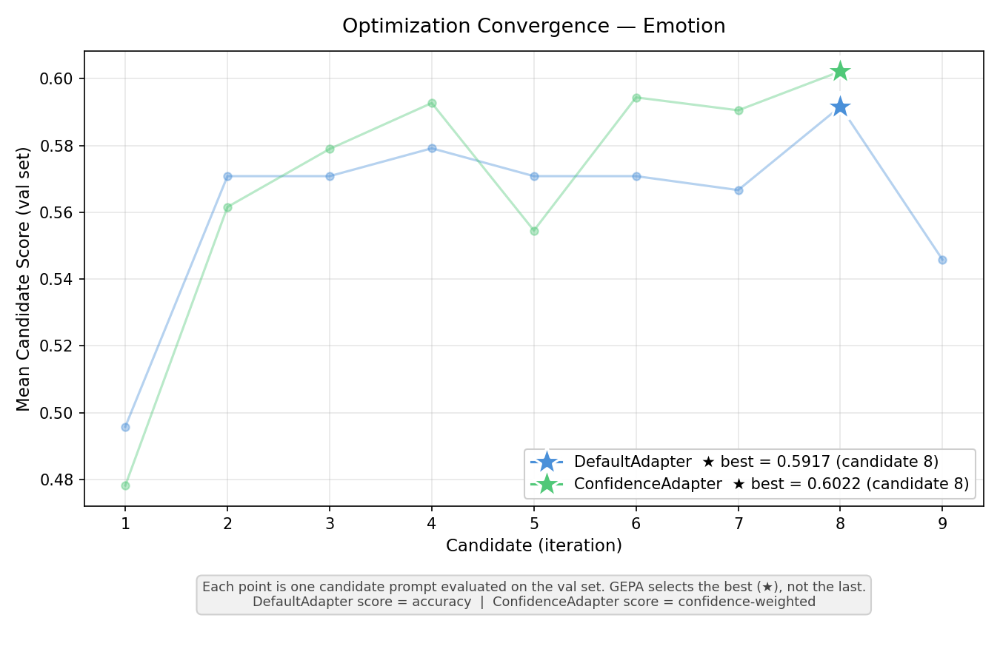
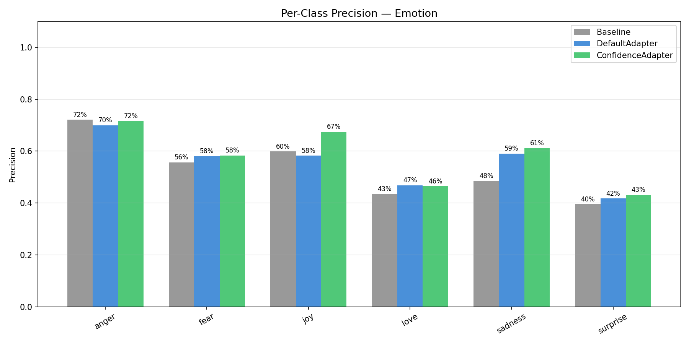
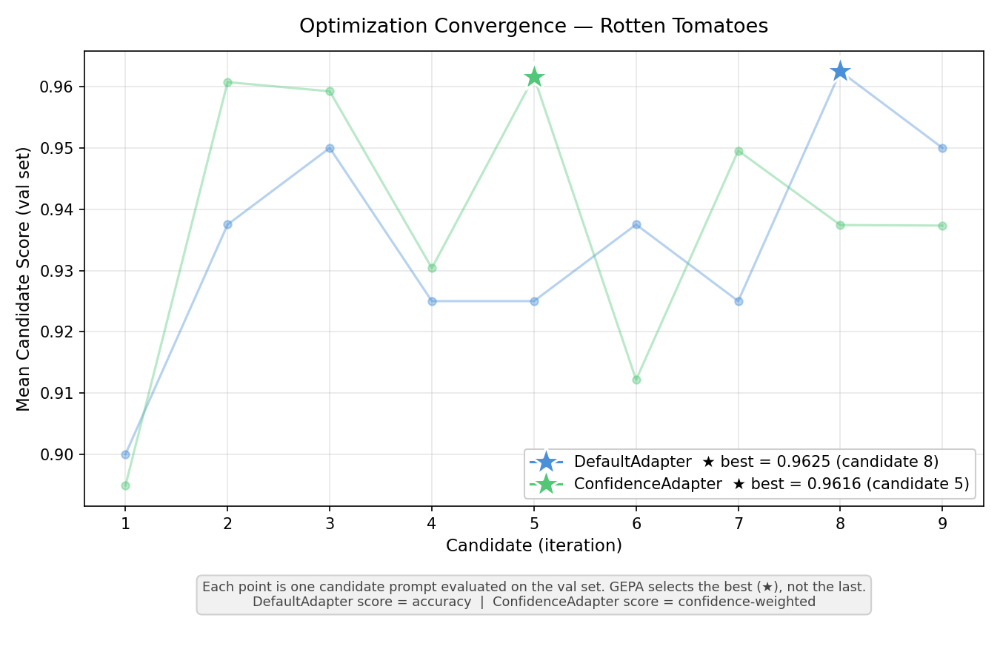
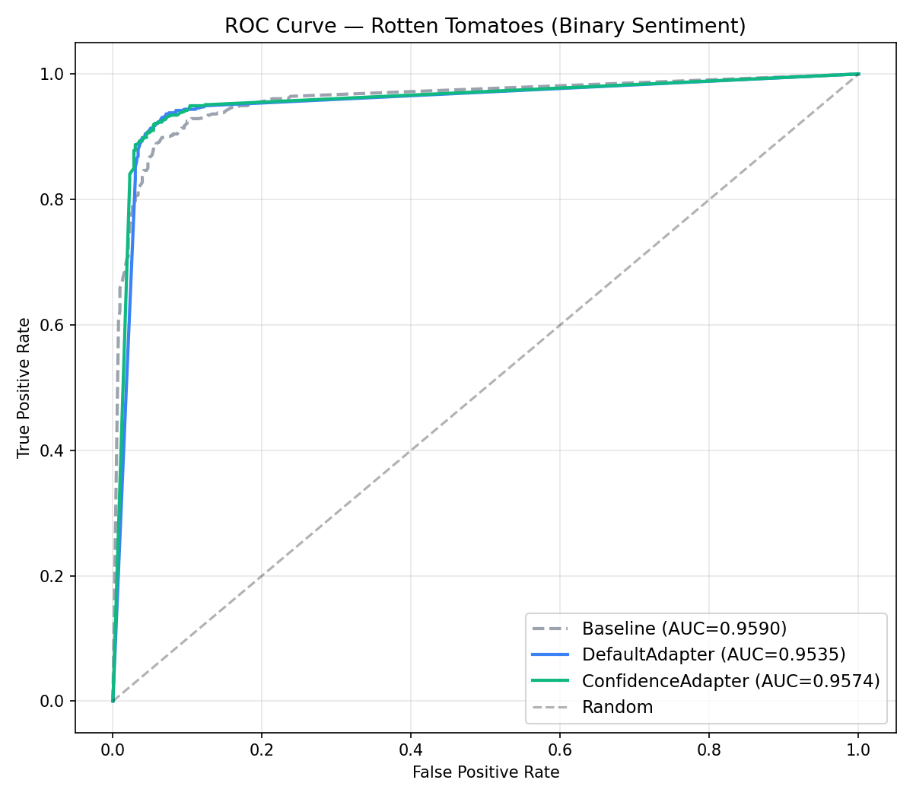
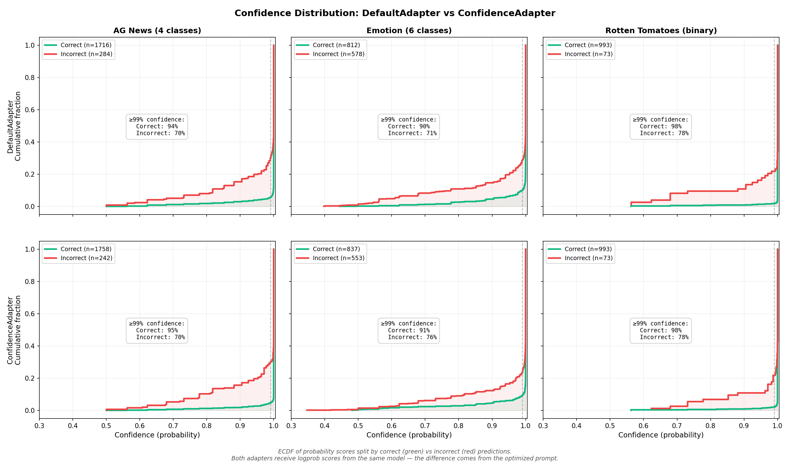

---
date:
  created: 2026-03-17
authors:
  - rodolfo
slug: confidence-adapter-benchmark
readtime: 15
title: "Confidence-Aware Prompt Optimization for LLM Classification"
description: "ConfidenceAdapter uses token-level log-probabilities to score prompt candidates on a continuous scale instead of binary correct/wrong, producing better disambiguation rules and higher-accuracy prompts for classification tasks."
---

# Confidence-Aware Prompt Optimization for LLM Classification

ConfidenceAdapter is a custom GEPA adapter that uses token-level log-probabilities from LLM structured output to score prompt candidates on a continuous scale instead of binary correct/wrong. By feeding the reflection LLM rich feedback about model uncertainty — including probability distributions and top alternatives — it produces better disambiguation rules and converges to higher-accuracy prompts. In experiments across AG News (4-class), Emotion (6-class), and Rotten Tomatoes (binary), ConfidenceAdapter matched or beat DefaultAdapter on all three datasets, with gains of **+2.10pp** and **+1.80pp** on the multiclass tasks.

<!-- more -->

---

## The Problem: Why Binary Scoring Falls Short

GEPA (a prompt optimizer) evaluates candidate prompts on a training set, reflects on errors, and proposes improvements. When using the DefaultAdapter, every evaluation collapses to a binary outcome: correct = 1.0, wrong = 0.0. This creates three fundamental problems.

**First, lucky guesses are rewarded equally with confident correct answers.** A model that answers "Business" at 51% probability — with "Sci/Tech" at 49% — gets the same score as one that answers "Business" at 99%. The first case is a coin flip; the next random seed or slight prompt variation could easily flip the prediction. Binary scoring treats both as perfect.

**Second, high-conviction errors need different feedback than uncertain errors.** When the model answers "Bills/Electricity" at 99% and the correct answer is "Bills/Gas & Oil," the prompt is actively misleading the model. It has no doubt about its wrong answer. Compare that to a model answering "Bills/Electricity" at 51% when the correct answer is "Bills/Gas & Oil" — here the model was nearly split between the two; better prompt guidance could easily fix this. DefaultAdapter gives the same generic feedback in both cases: "Incorrect. Expected X, got Y."

**Third, the optimizer gets no gradient signal.** With only 0 or 1, GEPA cannot distinguish between "almost right" and "completely wrong," or between "confidently correct" and "barely correct." The reflection LLM receives no information about *how* wrong or *how* uncertain the model was, so it cannot prioritize the most impactful improvements.

---

## The Solution: ConfidenceAdapter

ConfidenceAdapter uses the model's actual probability distribution over categories to produce both a continuous score and rich, tiered feedback for the reflection LLM.

### Structured Output and Logprobs

When an LLM is called with `logprobs=True` and structured output (a JSON schema with an `enum` of valid categories), the API returns token-level log-probabilities for each generated token. These logprobs represent the model's probability distribution over the vocabulary at each decoding step.

The API returns **log-probabilities** (logprobs), not raw probabilities. A logprob is the natural logarithm of a probability:

\[
\text{logprob} = \ln(p), \qquad p = e^{\text{logprob}}
\]

If the model assigns 42% probability to a token, the logprob is \(\ln(0.42) \approx -0.866\). To recover the probability: \(e^{-0.866} \approx 0.42\).

**Why logprobs instead of probabilities?** The joint probability of a multi-token sequence is the product of per-token probabilities. For a category tokenized into \(n\) tokens \(t_1, \dots, t_n\):

\[
P(\text{category}) = \prod_{i=1}^{n} P(t_i \mid t_1, \dots, t_{i-1})
\]

Multiplying probabilities in \([0, 1]\) approaches zero quickly. For short enum values (1–3 tokens), this is manageable — but LLM APIs return logprobs as the standard representation because they are used across all generation tasks, including long sequences where underflow is a real concern. With IEEE 754 double-precision floating point, the smallest normal positive number is approximately \(2.2 \times 10^{-308}\). A sequence of 100 tokens at 0.5 probability each gives \(0.5^{100} \approx 10^{-30}\), still representable — but at lower per-token probabilities or longer sequences, the product can **underflow** to exactly 0.0, losing all information.

The logarithm converts this product into a sum:

\[
\ln P(\text{category}) = \sum_{i=1}^{n} \ln P(t_i \mid t_1, \dots, t_{i-1})
\]

Sums of negative numbers stay well within floating-point range — \(\ln(10^{-30}) = -69\), a perfectly representable `float64`. After summing all logprobs, a single `exp()` call at the end recovers the joint probability. This representation is numerically stable regardless of sequence length, which is why it is the standard across all LLM APIs.

For classification, **the category name is composed of one or more tokens**. When each category starts with a unique first token — which is the common case for well-chosen enum values — the decision is fully determined at the first token. If two categories share the same first token (e.g., `"sports"` and `"sports_betting"`), the model needs additional tokens to disambiguate, and the library accounts for this by computing the joint probability across all tokens of each candidate. In the examples below, all categories have distinct first tokens, so the first token alone determines the classification. Consider this real example classifying the text *"i feel like i could mass mass of feelings that are just waiting to be felt"* into one of six emotion categories:

The model returns `{"category":"surprise"}` and the token-by-token logprobs look like this:

```
Token   Content      Logprob    Probability   Alternatives (raw tokens)
─────   ───────      ───────    ───────────   ─────────────────────────
  0     {"            0.0000    1.0000        (JSON structure — deterministic)
  1     category      0.0000    1.0000        (field name — deterministic)
  2     ":"           0.0000    1.0000        (JSON structure — deterministic)
  3     sur          -0.8584    0.4238        joy=-1.11 (0.33), f=-1.86 (0.16), sad=-2.61 (0.07), love=-4.11 (0.02), anger=-9.21 (<0.01)
  4     prise         0.0000    1.0000        (continuation — deterministic once "sur" is chosen)
  5     "}            0.0000    1.0000        (JSON structure — deterministic)
```

Token 3 is where the model makes its decision. `"surprise"` is tokenized as `"sur"` + `"prise"` — once the model commits to `"sur"`, the continuation `"prise"` follows deterministically at 100%. The **joint probability** of the full category is the product of all its token probabilities:

Applying the formula above: \(P(\text{"surprise"}) = P(\text{"sur"}) \times P(\text{"prise"}) = 0.4238 \times 1.0 = \mathbf{0.4238}\)

In log space: \(\ln P(\text{"surprise"}) = \ln(0.4238) + \ln(1.0) = -0.858 + 0.0 = -0.858\), then \(e^{-0.858} = 0.4238\).

Because the response is constrained to a JSON schema with an `enum`, the model can only emit tokens that begin a valid category name at this position. The `top_logprobs` field in the API response lists the most probable alternatives at each position — here, the first tokens of other categories. Notice that these are **raw tokens**, not category names: `"f"` is the first token of `"fear"` (tokenized as `"f"` + `"ear"`), and `"sad"` is the first token of `"sadness"` (tokenized as `"sad"` + `"ness"`), while `"joy"`, `"love"`, and `"anger"` happen to be complete single tokens. Each partial token uniquely identifies a category given the enum constraint — once `"f"` is chosen, only `"ear"` can follow to form a valid enum value. The library resolves this automatically: it knows the valid enum values from the JSON schema, so it maps each first token back to the full category name and assigns it the first token's probability (since all continuation tokens are deterministic at 100%). This is how we get a complete probability distribution over all classes from a single decision token:

| Token | Resolved category | Probability |
|-------|-------------------|-------------|
| `sur` | surprise | 42.38% |
| `joy` | joy | 33.01% |
| `f` | fear | 15.59% |
| `sad` | sadness | 7.37% |
| `love` | love | 1.64% |
| `anger` | anger | 0.01% |

This is a genuinely uncertain prediction — binary scoring would give it a perfect 1.0 if it happens to be correct.

Compare with a more confident prediction — *"i feel nostalgic about the times we spent together as children"*:

| Token | Content | Logprob | Probability | Alternatives |
|-------|---------|---------|-------------|--------------|
| 3 | `sad` | -0.0267 | 0.9737 | `joy`=-4.03 (0.018), `love`=-4.78 (0.008) |
| 4 | `ness` | 0.0000 | 1.0000 | (continuation — deterministic) |

\(P(\text{"sadness"}) = P(\text{"sad"}) \times P(\text{"ness"}) = 0.9737 \times 1.0 = \mathbf{0.9737}\)

Here the model is 97.4% confident in `"sadness"`. This is meaningfully different from the 42.4% case above, but binary scoring treats both identically.

The [`llm-structured-confidence`](https://github.com/rodolfonobrega/llm-structured-confidence) library automates this extraction. Given the raw LLM response, it:

1. Identifies which tokens correspond to the target field (`category`) using the JSON schema
2. Computes the **joint probability** across all tokens of the category value (product of per-token probabilities)
3. Resolves **top alternatives** — matching partial tokens like `"sur"` → `"surprise"` and `"f"` → `"fear"` using the enum constraint
4. Returns a structured result with the predicted value, its probability, and the ranked alternatives with their probabilities

```python
from llm_structured_confidence import extract_logprobs

conf = extract_logprobs(response, field_path="category", response_schema=schema)
# conf = {
#   "value": "surprise",
#   "joint_probability": 0.4238,
#   "top_alternative_resolved": "joy",
#   "top_alternative_probability": 0.3301,
#   "top_logprobs": [("surprise", 0.4238), ("joy", 0.3301), ("fear", 0.1559), ...]
# }
```

This gives ConfidenceAdapter everything it needs: the probability of the chosen category, the top alternative and its probability, and the full ranked distribution.

### LinearBlendScoring

Instead of binary 0/1, ConfidenceAdapter uses LinearBlendScoring:

- **If incorrect:** score = 0.0
- **If correct and probability ≥ threshold (0.99):** score = 1.0
- **If correct and probability < threshold:** score = min_score + (1.0 − min_score) × (probability / threshold)

With `min_score=0.3` and `threshold=0.99`, a correct answer at 95% probability yields: 0.3 + 0.7 × (0.95/0.99) ≈ 0.972. The optimizer now receives a gradient: higher confidence on correct answers yields higher scores.

### Feedback Design

The reflection LLM receives feedback tailored to the prediction's correctness and confidence:

| Scenario | Example Feedback |
|----------|------------------|
| Correct + confident (≥99%) | "Correct." |
| Correct + moderate (90–99%) | "Correct (95% probability). Close alternatives: 'X' (3%)." |
| Correct + uncertain (<90%) | "Correct but uncertain (73% probability). Model was nearly split with alternatives. Top alternatives: 'X' (24%). The model cannot reliably distinguish between these categories with the current prompt." |
| Wrong + low confidence | "Wrong (60% probability). Expected 'Y' but got 'Z'. The model was uncertain — better prompt guidance could fix this." |
| Wrong + high confidence (≥99%) | "WRONG — model has 99% certainty on 'Z' but the correct answer is 'Y'. The prompt is actively misleading it for this type of input. The prompt must add explicit rules to disambiguate 'Z' vs 'Y'." |

Correct, confident predictions get minimal noise. Errors — especially high-conviction errors — get maximum signal, including probability details and top alternatives, so the reflection LLM can propose targeted disambiguation rules.

---

## Key Design Decision: Threshold Calibration

### The calibration problem

A perfectly calibrated model would assign a probability that matches its actual accuracy: when it says 80%, it should be right 80% of the time. In practice, **LLM calibration varies significantly across models and configurations**. When the response is constrained to an enum, the constrained decoding process concentrates probability mass on the chosen token — but how much it concentrates depends on the model. Architecture, training data, alignment tuning (RLHF/DPO), and the specific constrained decoding implementation all influence the resulting probability distribution.

Some models produce well-spread distributions where a 70% prediction genuinely reflects uncertainty. Others — like GPT-4.1-mini with structured output, used in our experiments — tend to produce probabilities between 95–100% even for incorrect predictions. **You should not assume any particular distribution; instead, evaluate your model's calibration before choosing thresholds.**

Why this matters: if a model produces consistently high probabilities and you set a threshold at 70%, virtually every prediction would be classified as "high confidence." The scoring would collapse to binary (everything gets a perfect score if correct), and ConfidenceAdapter would behave identically to DefaultAdapter — gaining nothing from the logprob signal. Conversely, setting a 99% threshold on a model that rarely exceeds 85% would penalize every prediction, losing the ability to distinguish confident from uncertain answers.

### Configurable thresholds

ConfidenceAdapter addresses this with two configurable thresholds that should be tuned for the model in use:

- **high_confidence_threshold = 0.99** — only predictions above 99% probability receive a full score of 1.0. Below this, the score decreases proportionally via LinearBlendScoring.
- **low_confidence_threshold = 0.90** — correct predictions below 90% probability are flagged as "unreliable" in the reflection feedback, prompting the reflection LLM to address the ambiguity.

The effect on scoring gradients:

| Probability | Score (threshold=0.99) |
|-------------|------------------------|
| 0.999       | 1.000                  |
| 0.99        | 1.000                  |
| 0.95        | 0.972                  |
| 0.90        | 0.936                  |
| 0.80        | 0.866                  |
| 0.50        | 0.654                  |

With a 0.99 threshold, a correct answer at 95% probability scores 0.972 instead of 1.0. This small penalty accumulates across the evaluation set, giving GEPA a clear signal to prefer prompts that produce more confident correct answers.

**Choosing the right thresholds:** Run a small sample of predictions with your model and look at the probability distribution. If most correct predictions are above 99%, set `high_confidence_threshold=0.99`. If your model produces more spread-out probabilities (e.g., correct answers commonly between 70–90%), a lower threshold like 0.85 may be more appropriate. The goal is to place the threshold where the model's "confident" and "uncertain" predictions naturally separate.

---

## Experiment Setup

### Datasets

| Dataset | Type | Classes | Train/Class | Val/Class | Test Total |
|---------|------|---------|-------------|-----------|------------|
| AG News | Multiclass | 4 (World, Sports, Business, Sci/Tech) | 120 | 40 | 2000 |
| Emotion | Multiclass | 6 (sadness, joy, love, anger, fear, surprise) | 120 | 40 | 1390* |
| Rotten Tomatoes | Binary | 2 (positive, negative) | 120 | 40 | 1066* |

*The test set target was 2000 examples (balanced across classes). AG News has a large enough test split to reach this target (500 per class). Emotion and Rotten Tomatoes have smaller HuggingFace test splits, so we used as many balanced examples as available: 1390 for Emotion (limited by minority classes like surprise with only 66 examples) and 1066 for Rotten Tomatoes (533 per class).

The training set is intentionally larger than the validation set. In LLM classification, the model doesn't "learn" from training examples the way a fine-tuned model would — they only feed the reflection loop. Each iteration, GEPA randomly samples a minibatch (20 per class) from the training set and evaluates the current prompt to find errors. A larger pool (120 per class) ensures that each minibatch exposes the reflection LLM to different combinations of errors across iterations, improving the diversity of feedback. The validation set (40 per class) is evaluated in full every iteration and is used to rank prompt candidates — 40 per class is sufficient for reliable ranking without being the bottleneck.

### Models and GEPA Configuration

- **Task model:** GPT-4.1-mini (`temperature=0`, no reasoning/chain-of-thought)
- **Reflection model:** Claude Sonnet 4.6 (thinking enabled, `budget_tokens=1024`)
- **GEPA:** ~10 iterations, same budget for both adapters
- **Reflection minibatch:** 20 examples per class per iteration
- **Structured output:** JSON schema with enum constraint on the category field

### Reproducibility

All random operations use **seed=42**: dataset shuffling and stratified splits (`random.Random(42)`), NumPy (`np.random.seed(42)`), LLM calls (`seed=42` parameter), and GEPA optimization (`seed=42`). The seed prompt is: *"Classify the following text into one of the given categories."*

The full experiment script is available at [`examples/confidence_adapter/main.py`](https://github.com/gepa-ai/gepa/tree/main/examples/confidence_adapter).

---

## Results

### Overall Accuracy

| Dataset | Baseline | DefaultAdapter | ConfidenceAdapter | Delta (Conf − Default) |
|---------|----------|----------------|-------------------|------------------------|
| AG News | 83.70% | 85.80% | **87.90%** | **+2.10pp** |
| Emotion | 54.03% | 58.42% | **60.22%** | **+1.80pp** |
| Rotten Tomatoes | 91.46% | 93.15% | 93.15% | 0.00pp |

<figure markdown="span">
  
  <figcaption>Figure 1 — Test accuracy (%) for Baseline, DefaultAdapter, and ConfidenceAdapter across all three datasets.</figcaption>
</figure>

### Precision, Recall, and F1 (Weighted Average)

| Dataset | Condition | Precision | Recall | F1 |
|---------|-----------|-----------|--------|-----|
| AG News | Baseline | 86.47% | 83.70% | 83.02% |
| | DefaultAdapter | 87.31% | 85.80% | 85.59% |
| | **ConfidenceAdapter** | **87.83%** | **87.90%** | **87.84%** |
| Emotion | Baseline | 56.05% | 54.03% | 53.03% |
| | DefaultAdapter | 58.66% | 58.42% | 58.16% |
| | **ConfidenceAdapter** | **61.75%** | **60.22%** | **60.30%** |
| Rotten Tomatoes | Baseline | 91.55% | 91.46% | 91.46% |
| | DefaultAdapter | 93.16% | 93.15% | 93.15% |
| | ConfidenceAdapter | 93.19% | 93.15% | 93.15% |

ConfidenceAdapter leads in all weighted metrics on AG News and Emotion. The F1 gains are +2.25pp on AG News and +2.14pp on Emotion over DefaultAdapter. On Rotten Tomatoes, performance is effectively tied.

<figure markdown="span">
  
  <figcaption>Figure 2 — Weighted-average Precision, Recall, and F1 for all conditions and datasets.</figcaption>
</figure>

---

### AG News (4-Class): Per-Class Analysis

| Class | Condition | Precision | Recall | F1 |
|-------|-----------|-----------|--------|-----|
| **Sci/Tech** | Baseline | 94.29% | 52.80% | 67.69% |
| | Default | 95.63% | 65.60% | 77.82% |
| | **Confidence** | **85.21%** | **81.80%** | **83.47%** |
| **Business** | Baseline | 67.33% | 95.20% | 78.87% |
| | Default | 74.39% | 91.20% | 81.94% |
| | **Confidence** | **84.92%** | **82.20%** | **83.54%** |
| Sports | Baseline | 95.73% | 98.60% | 97.14% |
| | Default | 95.95% | 94.80% | 95.37% |
| | Confidence | 95.70% | 98.00% | 96.84% |
| World | Baseline | 88.55% | 88.20% | 88.38% |
| | Default | 83.27% | 91.60% | 87.24% |
| | Confidence | 85.50% | 89.60% | 87.50% |

The most striking change is the **Sci/Tech vs Business tradeoff**. With the baseline, the model had a strong bias: it predicted "Business" aggressively (95.2% recall) but at the expense of Sci/Tech (only 52.8% recall). Many technology articles about companies like Oracle, Microsoft, or Intel were misclassified as Business because they mentioned financial aspects. DefaultAdapter improved this but maintained the bias. ConfidenceAdapter resolved it: Sci/Tech recall jumped from 52.8% to 81.8%, and Business precision rose from 67.3% to 84.9%. The F1 scores converged — Business went from 78.9% to 83.5%, Sci/Tech from 67.7% to 83.5% — producing a much more balanced classifier.

Sports and World maintained F1 close to the Baseline (96.8% vs 97.1% for Sports, 87.5% vs 88.4% for World), confirming that the large gains on the confusable Sci/Tech–Business axis did not come at the expense of the already well-separated classes.

This rebalancing is a direct result of the confidence-aware feedback. When the model confidently misclassified a tech article as Business, ConfidenceAdapter flagged it with: *"WRONG — model has 99% certainty on 'Business' but the correct answer is 'Sci/Tech'. The prompt must add explicit disambiguation rules."* The reflection LLM responded by adding rules like: *"Technology company news about SOFTWARE, HARDWARE, or TECH PRODUCTS → Sci/Tech, NOT Business, even if financial aspects are mentioned."*

<figure markdown="span">
  
  <figcaption>Figure 3 — Optimization convergence for AG News. Each point is one candidate prompt scored on the validation set. The star marks the best candidate selected by GEPA.</figcaption>
</figure>

<figure markdown="span">
  
  <figcaption>Figure 4 — Per-class precision for AG News. ConfidenceAdapter raises Business precision from 67% to 85%.</figcaption>
</figure>

<figure markdown="span">
  
  <figcaption>Figure 5 — Per-class recall for AG News. ConfidenceAdapter rebalances Sci/Tech vs Business.</figcaption>
</figure>

<figure markdown="span">
  
  <figcaption>Figure 6 — Per-class F1 for AG News. Both confusable classes converge to ~83.5%.</figcaption>
</figure>

---

### Emotion (6-Class): Per-Class Analysis

| Class | Condition | Precision | Recall | F1 | n |
|-------|-----------|-----------|--------|-----|---|
| sadness | Baseline | 48.47% | 76.28% | 59.28% | 333 |
| | Default | 59.04% | 66.67% | 62.62% | 333 |
| | **Confidence** | **61.13%** | **71.77%** | **66.02%** | 333 |
| joy | Baseline | 59.88% | 61.86% | 60.86% | 333 |
| | Default | 58.29% | 65.47% | 61.67% | 333 |
| | Confidence | 67.47% | 50.45% | 57.73% | 333 |
| love | Baseline | 43.44% | 33.33% | 37.72% | 159 |
| | Default | 46.83% | 37.11% | 41.40% | 159 |
| | **Confidence** | **46.50%** | **58.49%** | **51.81%** | 159 |
| anger | Baseline | 72.14% | 36.73% | 48.67% | 275 |
| | Default | 69.95% | 54.18% | 61.07% | 275 |
| | **Confidence** | **71.62%** | **57.82%** | **63.98%** | 275 |
| fear | Baseline | 55.66% | 52.68% | 54.13% | 224 |
| | Default | 58.12% | 60.71% | 59.39% | 224 |
| | **Confidence** | **58.33%** | **62.50%** | **60.34%** | 224 |
| surprise | Baseline | 39.58% | 28.79% | 33.33% | 66 |
| | Default | 41.79% | 42.42% | 42.11% | 66 |
| | **Confidence** | **43.18%** | **57.58%** | **49.35%** | 66 |

Emotion is the hardest dataset with 6 classes, several of which are inherently confusable (joy vs love, sadness vs fear, anger vs sadness). ConfidenceAdapter improved F1 on 5 of the 6 classes, with the largest gains on the minority classes: **love** (+10.4pp over Default), **surprise** (+7.2pp), and **anger** (+2.9pp).

The one class where ConfidenceAdapter scored lower was **joy** (F1: 61.7% → 57.7%). Looking at the precision/recall breakdown, ConfidenceAdapter made joy much more precise (67.5% vs 58.3%) but at the cost of recall (50.5% vs 65.5%). This happened because the optimizer learned to be more careful about what it labels "joy" — many texts that superficially look joyful actually express love, surprise, or even sadness. The confidence signal pushed the prompt toward stricter joy criteria, which reduced false positives but also caught fewer true positives.

This is a **generalization tradeoff** worth noting: ConfidenceAdapter tends to produce more balanced classifiers that don't over-predict dominant classes. The overall F1 improved (+2.14pp), but individual classes can shift. This is a desirable property for most applications — a balanced classifier is more useful than one that over-predicts popular classes — but it's worth validating per-class performance for your specific use case.

<figure markdown="span">
  
  <figcaption>Figure 7 — Optimization convergence for Emotion.</figcaption>
</figure>

<figure markdown="span">
  
  <figcaption>Figure 8 — Per-class precision for Emotion.</figcaption>
</figure>

<figure markdown="span">
  
  <figcaption>Figure 9 — Per-class recall for Emotion. ConfidenceAdapter redistributes recall from dominant classes (joy, sadness) toward minority classes (fear, surprise).</figcaption>
</figure>

<figure markdown="span">
  
  <figcaption>Figure 10 — Per-class F1 for Emotion.</figcaption>
</figure>

---

### Rotten Tomatoes (Binary): Per-Class Analysis

Both adapters tied at 93.15% test accuracy (+1.69pp over baseline). Best validation results were nearly identical: 0.9625 (DefaultAdapter) vs 0.9616 (ConfidenceAdapter).

| Class | Condition | Precision | Recall | F1 |
|-------|-----------|-----------|--------|-----|
| negative | Baseline | 89.61% | 93.81% | 91.66% |
| | Default | 92.44% | 94.00% | 93.21% |
| | Confidence | 91.97% | 94.56% | 93.25% |
| positive | Baseline | 93.50% | 89.12% | 91.26% |
| | Default | 93.89% | 92.31% | 93.09% |
| | Confidence | 94.40% | 91.74% | 93.05% |

The per-class metrics reveal a subtle difference hidden by the accuracy tie. ConfidenceAdapter slightly favors negative recall (94.56% vs 94.00%) while DefaultAdapter slightly favors positive recall (92.31% vs 91.74%). Both are well-balanced with nearly identical F1 scores across classes. For binary classification with clearly distinct categories (positive vs negative sentiment), the confidence signal has limited room to differentiate — the model already reaches high probabilities on both classes, and the reflection LLM gets less actionable information from the alternatives since there is only one alternative category.

<figure markdown="span">
  
  <figcaption>Figure 11 — Optimization convergence for Rotten Tomatoes.</figcaption>
</figure>

The ROC curve provides a better view for binary classification, showing the trade-off between true positive and false positive rates at different decision thresholds. All three conditions achieve AUC above 0.95, confirming strong discriminative ability.

<figure markdown="span">
  
  <figcaption>Figure 12 — ROC curve for Rotten Tomatoes binary classification. All conditions achieve AUC > 0.95.</figcaption>
</figure>

---

### Confidence Distribution

The ECDF (empirical cumulative distribution function) below shows the predicted probability (from logprobs) for both adapters, split by correct vs incorrect predictions. Both adapters use the same model — the difference comes from the optimized prompt.

**How to read this chart:** a well-calibrated model would show a large gap between the green and red curves — correct predictions clustered at high probability, incorrect predictions at low probability. That would mean the model "knows when it doesn't know," and you could trust the probability to flag uncertain predictions for human review. What we see instead is a **small gap**: even 70–78% of incorrect predictions have ≥99% probability. GPT-4.1-mini with structured output is poorly calibrated — it is nearly as confident on wrong answers as on right ones. This is exactly why the 0.99 threshold is necessary; anything lower would treat most errors as "high confidence" and flatten the optimization signal.

Comparing the two rows reveals that **the confidence distributions are nearly identical between the two adapters.** This is the most important takeaway: ConfidenceAdapter's advantage does not come from making the model "more confident overall" — it comes from making the model get the right answer on more examples, through better disambiguation rules in the prompt. The underlying model is the same; what changes is which examples fall on the correct side.

<figure markdown="span">
  
  <figcaption>Figure 13 — Predicted probability ECDF: DefaultAdapter (top row) vs ConfidenceAdapter (bottom row). Green = correct predictions, red = incorrect. A large gap between curves indicates better calibration.</figcaption>
</figure>

The numerical breakdown reinforces this:

| Dataset | Adapter | Correct (n) | Incorrect (n) | ≥99% correct | ≥99% incorrect | Gap |
|---------|---------|-------------|----------------|-------------|----------------|-----|
| AG News | Default | 1716 | 284 | 94.4% | 69.7% | +24.7pp |
| | **Confidence** | **1758** | **242** | **95.3%** | **69.8%** | **+25.4pp** |
| Emotion | Default | 812 | 578 | 89.8% | 71.5% | +18.3pp |
| | **Confidence** | **837** | **553** | **90.7%** | **76.5%** | **+14.2pp** |
| Rotten Tomatoes | Default | 993 | 73 | 98.1% | 78.1% | +20.0pp |
| | Confidence | 993 | 73 | 97.9% | 78.1% | +19.8pp |

On AG News, ConfidenceAdapter gets 42 more predictions right while maintaining a slightly wider confidence gap. On Emotion, it gets 25 more right, but the remaining errors are *more* confident (76.5% vs 71.5% above 99%) — the prompt eliminated the uncertain errors, leaving behind the high-conviction mistakes that are hardest to fix. On Rotten Tomatoes, the distributions are indistinguishable.

This confirms that ConfidenceAdapter works by leveraging the confidence signal *during optimization* to produce better prompts — not by changing how the model distributes confidence at inference time.

---

## When to Use ConfidenceAdapter

**Use ConfidenceAdapter when:**

- You have a classification task with enum-constrained structured output
- Your model exposes logprobs (e.g., OpenAI gpt-4.1-*, Gemini)
- The task has many confusable categories (e.g., emotions, fine-grained topics)
- You want the optimizer to generate targeted disambiguation rules

**Stick with DefaultAdapter when:**

- The task is very simple (e.g., straightforward binary sentiment)
- Your model does not support logprobs
- You need minimal API overhead and do not require confidence-based feedback

---

## Conclusion

ConfidenceAdapter consistently matched or beat DefaultAdapter across all three datasets. The largest gains came on the hardest task (Emotion: +1.80pp) and the most structured multiclass task (AG News: +2.10pp). On Rotten Tomatoes, both adapters tied, showing that ConfidenceAdapter does not hurt performance on simpler tasks.

Two factors drive these results. First, **continuous scoring via LinearBlendScoring** gives the optimizer a gradient to work with: it can distinguish "confidently correct" from "barely correct," penalizing lucky guesses and rewarding prompts that produce genuinely certain predictions. Second, **rich, tiered feedback** — especially the strong signal on high-conviction errors — helps the reflection LLM write targeted disambiguation rules instead of generic corrections. The combination produces prompts that are both more accurate and more robust across classes.

For practitioners using GEPA for classification tasks with structured output, ConfidenceAdapter is a direct upgrade: same API surface, same budget, better results — particularly when categories are ambiguous or confusable.

**Getting started:**

- [Confidence-Aware Classification Guide](../../../guides/confidence-adapter.md) — step-by-step usage guide with code examples
- [ConfidenceAdapter API Reference](../../../api/adapters/ConfidenceAdapter.md) — full parameter documentation
- [Hands-on AG News Tutorial Notebook](../../../tutorials/confidence_adapter_classification.ipynb) — compare `DefaultAdapter` and `ConfidenceAdapter` end-to-end and inspect confidence plots
- [Reproducible experiment script](https://github.com/gepa-ai/gepa/tree/main/examples/confidence_adapter) — the code and data used in this benchmark
